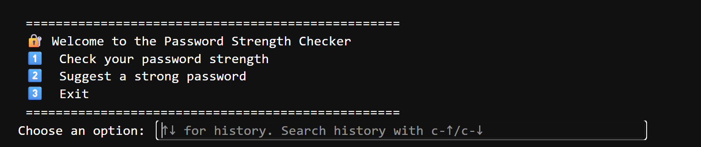
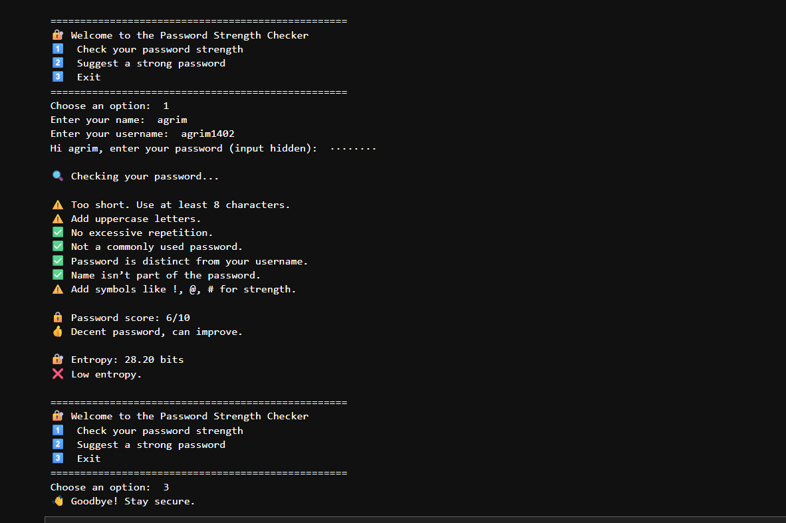
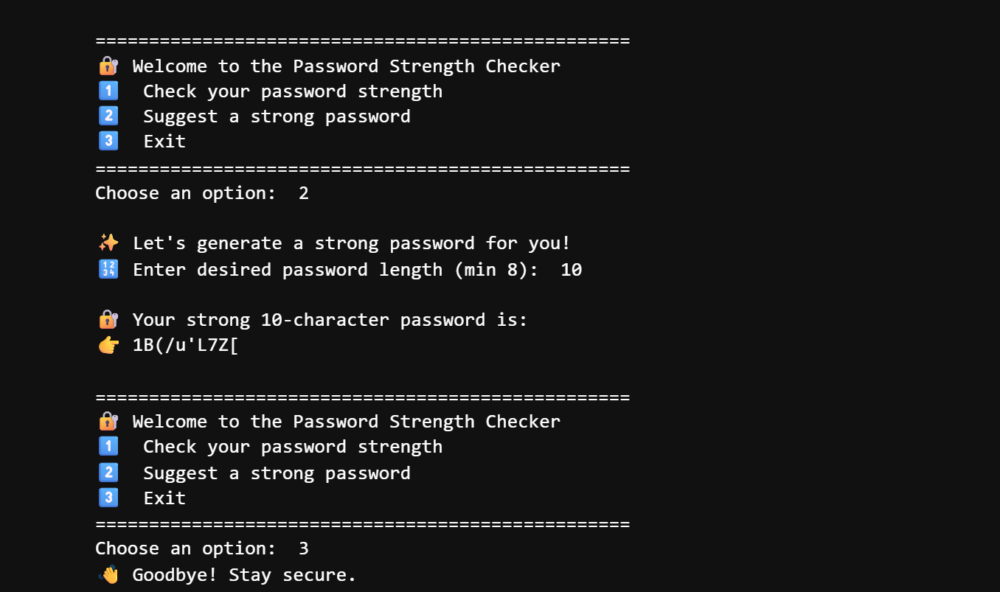

# 🔐 Password Strength Checker

A Python-based Password Strength Checker and Password Generator that evaluates password security using multiple checks and entropy calculations.

## Features

- Password length validation
- Uppercase and lowercase checks
- Repeated character detection
- Common password detection
- Username similarity check
- Name similarity check
- Special character validation
- Entropy calculation
- Strong password generator

## Installation

```bash
git clone https://github.com/yourusername/password-strength-checker.git
cd password-strength-checker
pip install -r requirements.txt
```

## Run

```bash
python password_checker.py
```

## Screenshots






